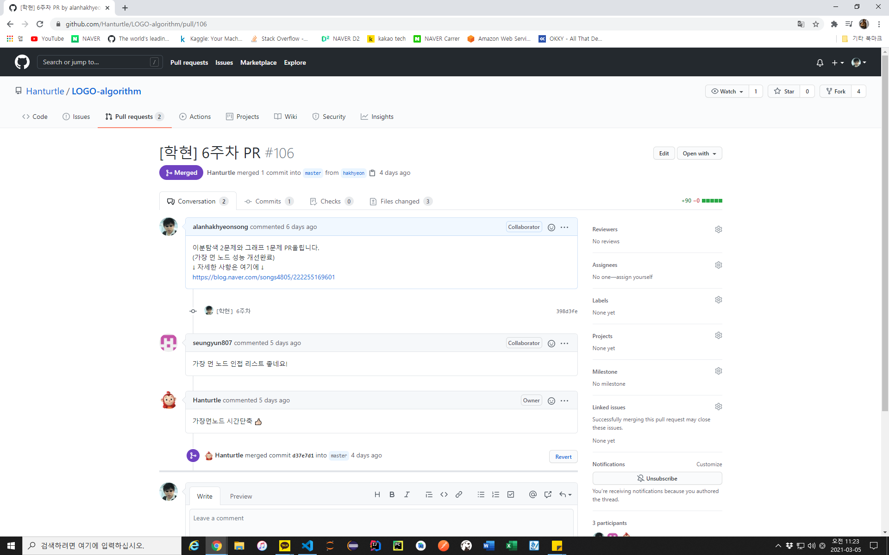

# LOGO Algorithm Study 회고

## 1. 서론

> 안녕하세요 송학현입니다.
>
> 우선 기존에 스터디를 진행하고 계셨던 분들께서 겨울방학 동안 새로 플랫폼을 바꾸고 시작할 때 저를 초대해주셔서 감사합니다. 그렇게 시작한 이 스터디가 벌써 7주차에 접어들며 새로 플랫폼을 바꿀 시기와 더불어 새 학기가 개강했다는 점에서 정말 시간이 빨리 지났네요. 방학기간동안 느슨해질 수도 있지만, 여러분 덕에 기분 좋은 적당한 긴장감을 느낄 수 있었고, 함께 성장하는 값진 경험을 할 수 있었습니다. 아무래도 후발주자이다보니 부족한 점이 많았습니다. 스터디 시스템에 대한 이해도와 PS 실력까지도요.
>
> 자 그러면, 제가 이번 스터디를 통해 얻은 점과 부족했던 점, 더 나아가 개선해야 할 점을 서술하겠습니다.

## 2. 스터디를 통해 얻은 점

- PS 공부
> 가장 첫 번째는 Algorithm 문제를 풀이하는 경험입니다. 저는 지난 가을학기에 알고리즘 과목을 처음 학습하고 딱히 문제를 풀어보진 않았어서 코드 작성에 자신있는 편이 아닙니다. 늘 이론적인 부분만 빠삭하지 알고 있는 것을 코드로 작성해보라 요구하면 막힐 때가 많았습니다. 이 때문에 처음 지원님께서 스터디를 제안하실 때 저 스스로 걱정했던 부분이 한두가지가 아니었습니다. 제가 잘 따라갈 수 있을까 말이죠.
>
> 지난해는 COVID-19 때문에 복학을 했어도 학교를 가지 못해 사람들을 만나지 못한 웃픈 상황이었습니다. 이 때문에 학교 수업을 공부 하는 것도, 수업 외적으로 개인적인 공부를 하는 것도 제 스스로 잘 하고 있는 건지 알 수 없어 스스로 피드백을 하는데 한계가 있었습니다. 이런 경험 때문에 프로그래밍 실력이 뛰어나지 않아 걱정되더라도 혼자 공부하지 않고 스터디에 참여하여 다른 사람들과 같이 공부하고자 하였습니다. 여러분들께서 열심히 참여하시는 모습을 보고 자극받아 더 잘하려 노력한 부분도 없지 않았습니다.
>
> 매 주차별로 Programmers의 시스템 대로 유형별로 몇 문제 씩 간단히 풀이하다보니 솔루션을 보지 않고 완벽하게 풀이하는데 한계가 있었더라도 PS를 접근하는 감각과 앞으로  Algorithm 공부는 어떤식으로 해야 할지 큰 그림이 그려졌습니다. 초심자이기 때문에 조급하게 생각해서 너무 서두르지 말자는 생각도 들었습니다. 다만 꾸준함이 중요하겠지요.
>
> PS를 공부하다보면, 문제 풀이의 main logic을 생각하며 고민하는 과정 때문에 저절로 신경써야 할 부분이 어디인지 오류나 성능 개선은 어떻게 해결해야 할지에 생각하게 되었고 전공 수업으로 프로그래밍 언어를 단순히 배운 것을 넘어 다양한 메소드와 API 활용에 대한 감각을 키우기 때문에 어느 순간 실력이 향상되고 있다는 점을 느꼈습니다.

- Github 사용법, markdown 작성법
> 저는 지난 여름부터 시간날 때 기술 블로그를 정리하곤 했지만, 여건상 github를 제대로 활용하기 시작한건 이번 겨울방학부터입니다. 개인적으로 repository를 만들어 관리하다보면 여러 사람들과 같이 작업하는게 아니라 혼자 하는 것이기 때문에 하나의 branch로 관리만 할 뿐 fork와 PR등은 딱히 쓸 일이 없어 제대로 경험했다고 하긴 민망합니다.
>
> 하지만 본 스터디는 Algorithm PS 공부와 더불어 참여자 모두가 branch를 생성하여 자신이 코드를 올리는 것을 넘어 일련의 버전 관리를 경험하는 형식으로 진행했기 때문에 github에 대한 이해도가 충분히 생겼다고 생각합니다.
>
> 개발자라면 markdown 작성을 통해 프로젝트에 대한 간단한 서술을 하며 관리하는 것이 기본입니다. 본 스터디의 운영진들의 노고가 컸다는 점은 스터디활동을 매번 꼼꼼하게 정리한 점과 더불어 참여자 모두가 markdown의 중요성을 느끼고 작성법을 경험하게 해주신 것입니다. 저도 개인적으로 TIL을 관리할 때 이 스터디를 통해 경험한 덕에 깔끔하게 관리하는 능력이 어느정도 생기고 있습니다.

- 코드 리뷰와 토론
> 그룹 스터디의 본질은 다양한 의견 제시를 통한 토론과 피드백입니다. 비대면의 이점을 잘 활용하여 매주 1회 화상으로 각자 문제를 정해 풀이를 발표하며 소통하다보니 각자 점검을 수월하게 할 수 있었습니다. 모두 이 시스템을 많이 경험하지 않았어서 아직 미숙하고 개선해야 될 점도 많겠지만, 다른 사람의 풀이과정과 코드를 보며 좀 더 효율적이고 간결하게 작성하는 방법에 대해 고민해보는 시간을 가졌고 아이디어가 떠오르지 않아 힘들 때 피드백을 받을 수 있다보니 저 스스로 부족한 부분이 어디인지 판단할 수 있었습니다.
>
> 한 가지 예시로 다음 사진을 보겠습니다.
> 
>
> 화상 발표 당시 효율성 개선에 대한 의견을 받았어서 해당 문제를 다시 풀이하였습니다. 저는 이 문제를 인접행렬로 풀이 하는 것이 코드짜기가 더 쉬워서 정답임을 확인하고 그냥 넘어갔지만, 의견을 제시해주신 덕분에 성능 개선을 고려하게 되었고 잘 사용하지 않았던 인접리스트를 활용하고자 비슷한 다른 문제를 풀이하며 logic을 익히게 되었고 결국 해결할 수 있게 되었습니다.

## 3. 개선해야 할 점
> 개인적으론 끊임 없이 물음표를 던지며 고민해보고 더 다양한 솔루션을 찾으려 했어야 하지만, 어느 순간 매너리즘에 빠져 테스트 통과를 하게되면 더 시도해보지 않았던 부분을 반성합니다.
>
> 게다가 우리 모두가 주입식 교육의 잔상인 것처럼 토론의 활성화가 부족하지 않았나 합니다. 모르는 것은 부끄러운게 아닙니다. 덧붙여 부끄러운 질문이란 없다고 생각합니다. 때문에 우리 모두 부끄럽다 생각하지 말고, 꼭 스터디 주제에 맞지 않더라도 slack의 질문방을 좀 더 활성화 하도록 노력합시다.

앞으로도 꾸준히 함께 성장하도록 합시다. 이상입니다.

// 
[겨울방학 회고](https://blog.naver.com/songs4805/222261383528)
